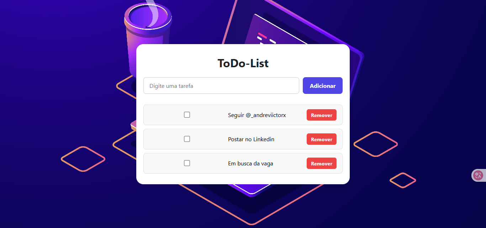

# 📝 ToDoList - Lista de Tarefas

Projeto simples e funcional de uma ToDo List desenvolvida com **HTML, CSS e JavaScript puro**.

A ideia é oferecer uma experiência limpa e intuitiva para adicionar, marcar como concluída e remover tarefas — tudo isso com **salvamento automático no localStorage**, ou seja, as tarefas continuam lá mesmo se você fechar o navegador.

---

## 🚀 Funcionalidades

- Adicionar novas tarefas
- Marcar tarefas como concluídas
- Remover tarefas da lista
- Salvamento automático no localStorage
- Design moderno e responsivo
- Interface leve, rápida e fácil de usar

---

## 📸 Preview



---

## 💻 Tecnologias usadas

- HTML5
- CSS3 (com Flexbox e responsividade)
- JavaScript (DOM, eventos, localStorage)

---

## 📂 Estrutura do projeto
📁 ToDoList-Tasks
├── 📁 src
│ ├── 📁 css
│ │ └── style.css
│ └── script.js
├── index.html
└── README.md


---

## 🧠 Conceitos aprendidos:

- Manipulação de DOM com JavaScript
- Eventos de clique e input
- Uso do `localStorage` para persistência de dados
- Boas práticas de responsividade com Flexbox
- Separação de responsabilidades entre HTML, CSS e JS

---

## ✨ Melhorias futuras

- Filtrar tarefas concluídas ou pendentes
- Editar tarefas
- Tema claro/escuro
- Integração com backend para login e sincronização entre dispositivos

---

## 📌 Como rodar o projeto

1. Clone o repositório:
   ```bash
   git clone https://github.com/andreviictorx/ToDoList-Tasks.git
 Acesse a pasta:
  cd ToDoList-Tasks
 Abre o arquivo index.html no navegador ou use Live Server

